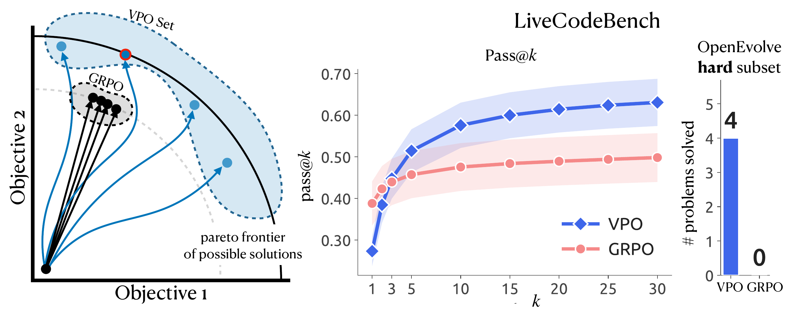
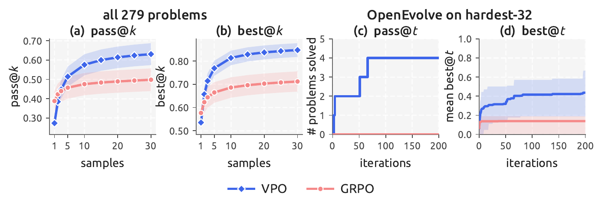
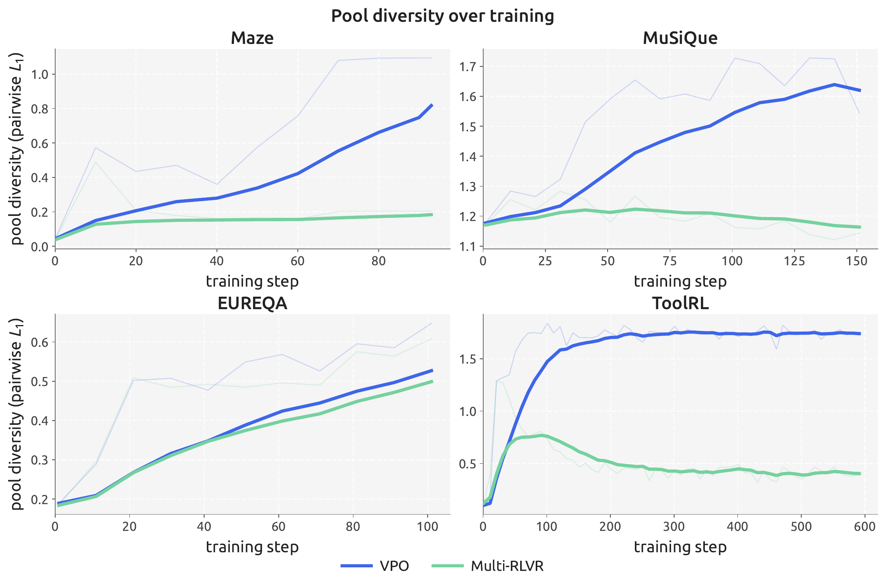
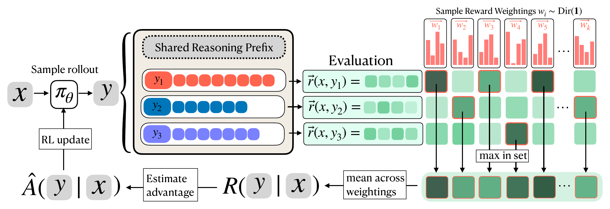
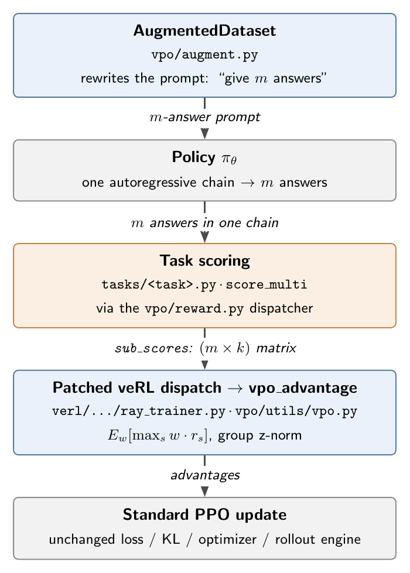

# VPO — Vector Policy Optimization

> A drop-in replacement for the GRPO advantage estimator. Most rewards are really *vectors* — several objectives we collapse into one number before training. VPO keeps the reward a vector and trains the policy to emit a **set of *m* solutions** that spread across different trade-offs, instead of converging onto a single best answer. It does this by optimizing over randomly sampled weightings `w ~ Dir(α=1)` of the objectives rather than one fixed weighting, which directly targets what test-time search cares about: `E_w[best-of-m]`. The goal is still strong performance under a fixed objective — the diversity is what makes downstream search pay off.

[](https://arxiv.org/abs/2605.22817)



> When maximizing a scalar, GRPO sends every rollout toward the same point. VPO simultaneously optimizes across different reward weightings, spreading candidates across the frontier of good solutions — higher pass@*k*, and it cracks search problems GRPO never solves.

**How it works.** Per rollout, `raw_score = E_w[max_{s in r} w·r_s]` — the expected best-of-*m* over the rollout's own solutions, under reward weightings `w` drawn from `Dir(α=1)`. Advantages are the usual GRPO z-norm within the prompt group. The single-solution fallback (`vpo_single`) wraps a flat *k*-vector as a 1×*k* matrix, so the same estimator handles m=1.

## Quickstart

```bash
# 1. Install
git clone https://github.com/ryanboldi/vpo.git && cd vpo
uv venv .venv --seed && source .venv/bin/activate
cd verl && pip install -e . && cd .. && pip install -e .

# 2. Prepare one dataset
python data/preprocess_maze.py --local_save_dir $HOME/data/maze

# 3. Run VPO on it
bash train.sh METHOD=vpo TASK=maze MODEL=Qwen/Qwen3-4B
```

Logs go to `logs/`, checkpoints to `checkpoints/`, and metrics to the `vpo_maze` project on W&B.

VPO ships as a small patch to the vendored veRL in this repo, so once it's installed, picking the
algorithm is just `METHOD=vpo` above. What that patch actually changes — and how to port it to a
different veRL — is documented in [VPO is a 3-file patch to veRL](#vpo-is-a-3-file-patch-to-verl).

## Notebooks

Four Colab notebooks for poking at VPO without a cluster.

| Notebook | What it does | GPU? |
|---|---|---|
| [`01_vpo_from_scratch.ipynb`](notebooks/01_vpo_from_scratch.ipynb) | A fake vector-reward task in ~50 lines of NumPy: same policy, same REINFORCE, only the reward differs — GRPO converges onto one solution, VPO stays diverse and wins the `E_w[best-of-m]` set metric. Tweak `α` to dial the diversity pressure. | No |
| [`02_advantage_explorer.ipynb`](notebooks/02_advantage_explorer.ipynb) | Loads the **real** `vpo.utils.vpo.vpo_advantage` from the repo, feeds it synthetic `(m, k)` matrices, visualizes how the advantage responds to coverage / `α` / sampler / variable `k`. | No |
| [`03_train_maze_colab.ipynb`](notebooks/03_train_maze_colab.ipynb) | End-to-end training run on a free Colab T4: Qwen2.5-0.5B + LoRA, 1 epoch on the synthetic maze task. ~30-45 min wall-clock. | T4 |
| [`03_train_musique_lora.ipynb`](notebooks/03_train_musique_lora.ipynb) | The same end-to-end LoRA recipe on a real dataset: MuSiQue multi-hop QA with the 5-dim vector reward. | T4 |

Click "Open in Colab" in any notebook to run it without local setup.

---

## Glossary

| Symbol | Meaning |
|---|---|
| **k** | number of reward dimensions for the task (e.g. k=4 for maze, k=5 for musique) |
| **m** | number of solutions the model emits per prompt (m=1 single-sol; m=3 or 5 multi-sol) |
| **w** | a reward **scalarization** (weighting of the k objectives), sampled from `Dir(α=1)` over the (k−1)-simplex |
| **sub_scores** | (m, k) score matrix returned by the reward function — the only new shape VPO needs |
| **uid** | per-rollout prompt-group id, used to z-norm within a group |

## Tasks

| Task | k | Objectives | Source |
|---|---|---|---|
| **maze** | 4 | completion, gold, diamond, avoid_lava | designed-conflict 9×9 grid (synthetic) |
| **musique** | 5 | hop_1..hop_4, answer_f1 | `dgslibisey/MuSiQue` |
| **eureqa** | 5 | entity_A..entity_E | `vincentleebang/EUREQA` |
| **tool** | 4 | format, tool_name, arg_key, arg_value | `qiancheng0/ToolRL` rlla_4k |
| **lcb** | up to 16 | per-test-case pass/fail | LiveCodeBench v6 |

## Results

VPO matches or beats the strongest scalar-RL baselines on test-time search (pass@*k* / best@*k*), with the gap widening as the search budget grows.



VPO produces solution *sets* that stay diverse through training instead of collapsing to one mode:



> Exact run configurations for every figure: [`PAPER_REPRO.md`](PAPER_REPRO.md).

---

## Installation

```bash
# Python 3.11 venv.
uv venv .venv --seed && source .venv/bin/activate

# Patched veRL (vendored — pin in REQUIRED_VERL.txt).
cd verl && pip install -e . && cd ..

# vpo package + all deps (pulls vllm==0.12.0, which pins torch==2.9.0; newer vLLM breaks veRL).
pip install -e .

# On RTX 50-series (Blackwell) or other GPUs that need CUDA 12.8 wheels, install the
# cu128 torch build explicitly:
#   pip install torch==2.9.0 --extra-index-url https://download.pytorch.org/whl/cu128
```

> **Why a vendored veRL?** VPO is a 3-file patch directly to veRL — same approach as [NVlabs/GDPO](https://github.com/NVlabs/GDPO). We ship the patched copy so you don't have to apply a diff yourself. See `docs/reproducibility.md` for the upstream pin.

## Data

Each task has one preprocess script; multi-solution and goal-conditioned variants are produced **on the fly** by `AugmentedDataset` (no separate preprocessing).

```bash
python data/preprocess_maze.py          --local_save_dir $HOME/data/maze
python data/preprocess_musique.py       --local_save_dir $HOME/data/musique
python data/preprocess_eureqa.py        --mode mixed_split --mixed_split_seed 0 \
                                        --local_save_dir $HOME/data/eureqa
python data/preprocess_tool.py          --local_save_dir $HOME/data/toolrl
python data/preprocess_livecodebench.py --local_save_dir $HOME/data/lcb
```

## Training

One unified launcher: `METHOD=` picks the algorithm, `TASK=` the domain, `MODEL=` the model; everything else (prompt/response length, m, GDPO keys, batch sizing) is derived automatically.

| Invocation | Method | adv_estimator | Reward shape |
|---|---|---|---|
| `train.sh METHOD=grpo` | GRPO baseline | `grpo` | scalar |
| `train.sh METHOD=gdpo` | GDPO baseline | `gdpo` | (k,) |
| `train.sh METHOD=maxrl` | MaxRL ([arXiv:2602.02710](https://arxiv.org/abs/2602.02710)) | `maxrl` | scalar |
| `train.sh METHOD=multi_rlvr` | Multi-RLVR baseline | `multi_rlvr` | (m, k) → scalar |
| **`train.sh METHOD=vpo`** | **VPO (ours)** | **`vpo`** | **(m, k)** |
| `train.sh METHOD=goal_cond` | Goal-conditioned GRPO | `grpo` (w in prompt) | scalar |

```bash
# VPO on maze (default model: Qwen3-4B, 4 GPUs):
bash train.sh METHOD=vpo TASK=maze

# Different model, more epochs, named tag:
bash train.sh METHOD=vpo TASK=eureqa MODEL=Qwen/Qwen3-8B EPOCHS=30 TAG=v1_run

# Forward any veRL Hydra override:
bash train.sh METHOD=vpo TASK=tool ++trainer.test_freq=10 ++actor_rollout_ref.actor.optim.lr=5e-7
```

> **First-run notes.** (1) The first optimizer step can take 10–15 minutes on cold caches —
> veRL/vLLM imports, Ray startup, and CUDA-graph capture all happen before any metric prints.
> It is not hung. (2) To run without a W&B account: `WANDB_MODE=offline bash train.sh METHOD=vpo ...
> ++trainer.logger=[console]`. (3) Default batch sizes assume 4×H100; `N_GPUS=1` automatically
> switches to a single-GPU preset sized for a 24–32 GB card with a ≤1B model — for larger
> models on one GPU, shrink `++data.train_batch_size` / `++actor_rollout_ref.rollout.n` further.

### Cluster

LSF (4× H100):

```bash
bsub -gpu "num=4/task:j_exclusive=yes:mode=shared" \
     -M 256GB -n 1 -W 1440 -J "vpo-maze" \
     bash train.sh METHOD=vpo TASK=maze
```

Slurm:

```bash
sbatch --gres=gpu:4 --mem=256G --time=24:00:00 -J vpo-maze \
       --wrap='bash train.sh METHOD=vpo TASK=maze'
```

`train.sh` already handles per-job `RAY_TMPDIR`, randomized `MASTER_PORT`, per-job `HF_DATASETS_CACHE`, and stable W&B run id (so a preempted job re-attaches). Safe to run multiple jobs on one shared node.

## Evaluation

In-loop validation runs every 50 steps (`val_kwargs.n=3, temperature=1.0, do_sample=True`) — for m=3 multi-solution methods this is one VPO inference vs three GRPO samples, the natural fairness cap.

Held-out eval after training:

```bash
# Checkpoints land in checkpoints/<project>/<experiment>/ where project is
# vpo_<task> and experiment is <method>_<task>_seed<seed>_<tag>. train.sh merges
# the final FSDP checkpoint to an actor/huggingface_merged/ dir for eval:
python eval/eval_maze.py \
    --model checkpoints/vpo_maze/vpo_maze_seed0_$TAG/global_step_*/actor/huggingface_merged \
    --method vpo --num-solutions 3 --n-chains 10 \
    --data-dir $HOME/data/maze --output results/eval_maze_vpo.json
```

`--num-solutions` defaults to 3 for multi-sol methods, 1 for single-sol.

---

## How VPO works



From prompt *x* the model writes *m* answers in one chain; each gets a reward vector. We sample many weightings *w* from a Dirichlet, take the best-of-*m* under each, and average — that scalar is the rollout's VPO reward. Concretely:



A multi-answer rollout looks like this (maze, m=3):

```
<user>  Find a route from S to E. ... Wrap each route in numbered tags
        (<route_1>...</route_1>, <route_2>...</route_2>, <route_3>...</route_3>).

<asst>  Let me think... I'll try a corner-hugging path, a diagonal, and a longer
        gold-collecting route.
        <route_1>RIGHT RIGHT RIGHT RIGHT DOWN DOWN DOWN DOWN</route_1>
        <route_2>DOWN RIGHT DOWN RIGHT DOWN RIGHT DOWN RIGHT</route_2>
        <route_3>RIGHT DOWN RIGHT DOWN DOWN RIGHT RIGHT DOWN</route_3>
```

`vpo_tasks/maze.py` parses 3 routes, scores each on `[completion, gold, diamond, avoid_lava]`, and returns a 3×4 matrix. `vpo_advantage` consumes that matrix and emits one scalar advantage per rollout.

→ **Full walkthrough**: [`docs/walkthrough.md`](docs/walkthrough.md) — from a researcher's perspective, including how to apply VPO to a new domain.

---

## VPO is a 3-file patch to veRL

The vendored `verl/` already has these applied; this section documents what changed so you can port the patch to a different veRL version.

### `verl/trainer/ppo/core_algos.py` — new enum values

```python
class AdvantageEstimator(str, Enum):
    GAE = "gae"
    GRPO = "grpo"
    # ... existing values ...
    VPO        = "vpo"          # (m, k) → own-pool E_w[max w·r_s]
    VPO_SINGLE = "vpo_single"   # single-sol fallback (m=1)
    MAXRL      = "maxrl"        # GRPO with std→mean normalizer
```

`MAXRL` is also implemented inline (Tajwar & Zeng, [arXiv:2602.02710](https://arxiv.org/abs/2602.02710)) — a one-line change to GRPO swapping the `std` normalizer for `mean`. The VPO advantage estimator (`vpo_advantage`, used by both `VPO` and the `vpo_single` fallback) lives in `vpo/utils/vpo.py`.

### `verl/trainer/ppo/ray_trainer.py` — dispatch

Two branches in `compute_advantage(...)` consume `sub_scores: (m, k)` and `uid: (B,)` (one for VPO, one for the single-sol fallback that wraps a flat k-vector as 1×k):

```python
elif adv_estimator == AdvantageEstimator.VPO:
    from vpo.utils.vpo import vpo_advantage
    sub_scores = data.non_tensor_batch["sub_scores"]
    index      = data.non_tensor_batch["uid"]
    advantages, diag = vpo_advantage(sub_scores, index)
    advantages = (advantages.unsqueeze(-1).to(data.batch["response_mask"].device)
                            * data.batch["response_mask"])
    data.batch["advantages"] = advantages
    data.batch["returns"]    = advantages
    data.meta_info["_vpo_diag"] = diag
```

`vpo_advantage` returns a dict of diagnostics routed to wandb each step
(`vpo/pool_size_mean`, `vpo/group_std_mean`, `vpo/own_pool_expected_max_mean`,
`vpo/pool_expected_best_mean`, `vpo/sampler_code`).

### `verl/experimental/agent_loop/agent_loop.py` — left-truncate prompts

`AugmentedDataset` rewrites prompts at `__getitem__`, after veRL's `filter_overlong_prompts` pass. Some rewrites push prompts over `max_prompt_length`. Without a fix, `tokenizer.pad` sees variable widths and `torch.cat` blows up at collate.

```python
if len(output.prompt_ids) > rollout_config.prompt_length:
    output.prompt_ids = output.prompt_ids[-rollout_config.prompt_length:]
```

### What is *not* in the patch

- No changes to the PPO loop, KL term, optimizer, or rollout engine.
- No new dataset format. Single-sol and multi-sol both produce `(m, k)` (m=1 for single-sol).
- No new reward interface beyond `sub_scores` — veRL already plumbs that through `non_tensor_batch`.

Switching `algorithm.adv_estimator=grpo` → `vpo` is the entire user-facing change. Multi-answer prompting (see [`docs/multi_answer_prompting.md`](docs/multi_answer_prompting.md)) is what makes the (m, k) shape meaningful.

---

## Using VPO outside veRL (trl, OpenRLHF, your own loop)

The algorithm is **decoupled from veRL**. `vpo.utils.vpo.vpo_advantage` is a pure
function — numpy + torch, no veRL import — so you can drop it into any GRPO-style
trainer. Its entire contract:

```python
from vpo.utils.vpo import vpo_advantage

# sub_scores : list of length B; entry i is rollout i's (m_i, k) reward MATRIX
#              (one row per solution the rollout emitted, one column per objective)
# uids       : (B,) array; rollouts that share a uid are one prompt group
# returns    : (advantages: torch.FloatTensor (B,),  diagnostics: dict)
advantages, diag = vpo_advantage(sub_scores, uids)   # group-normalized, ready for the PPO loss
```

Porting VPO to another framework is **three pieces**, none of them framework-specific:

1. **Multi-answer prompt** — ask the model for *m* answers in one generation
   (see [`docs/multi_answer_prompting.md`](docs/multi_answer_prompting.md); the
   per-task rewrite specs in `vpo_tasks/<task>.py` are copy-pasteable).
2. **An `(m, k)` scorer** — parse the *m* answers, score each on your *k*
   objectives → an `(m, k)` matrix per generation.
3. **Swap the advantage** — replace the trainer's group-normalized advantage
   (`(rewards − μ_group) / σ_group`) with `vpo_advantage(...)`.

### With trl's `GRPOTrainer`

trl already generates `num_generations` completions per prompt and groups them —
exactly VPO's prompt group. Subclass the trainer and replace the one step that
turns rewards into advantages:

```python
import numpy as np
from trl import GRPOTrainer
from vpo.utils.vpo import vpo_advantage

class VPOTrainer(GRPOTrainer):
    def score_to_matrix(self, completion) -> list[list[float]]:
        """YOUR task: parse m answers from `completion`, return an (m, k) matrix."""
        ...

    def vpo_advantages(self, completions, prompt_group_ids):
        sub_scores = [self.score_to_matrix(c) for c in completions]   # B × (m, k)
        adv, _ = vpo_advantage(sub_scores, np.asarray(prompt_group_ids))
        return adv                                                    # (B,)
```

Then wire `vpo_advantages(...)` into whichever method computes `advantages` in
your trl version — you're replacing the single `(rewards - mean) / std` line.

> **Don't normalize twice.** `vpo_advantage` already does the GRPO-style
> within-group z-norm. Turn off trl's own reward scaling (e.g.
> `GRPOConfig(scale_rewards=False)` in recent trl) so you don't normalize on top
> of an already-normalized advantage.

The shipped, tested integration is **veRL** (the 3-file patch above). trl/OpenRLHF
are clean ports because the estimator has no framework dependency — but you own
the prompt template and scorer on those paths.

## Tuning knobs

A handful of env vars cover most ablations. Full list in [`docs/walkthrough.md`](docs/walkthrough.md#parameters).

| Env var | Default | Effect |
|---|---|---|
| `VPO_SAMPLER` | `naive` | `naive` (iid Dirichlet) or `sobol` (quasi-MC, ~2-6× lower variance) |
| `VPO_ALPHA` | `1.0` | Dirichlet concentration. <1 sharpens to corners, >1 softens to centroid |
| `SEED` | `0` | Paper uses 0, 1, 2 (mean ± std) |
| `EPOCHS` | `50` | Per-task paper values in [`PAPER_REPRO.md`](PAPER_REPRO.md) |
| `N_GPUS` | `4` | Per-node GPU count; train.sh scales batch accordingly |

## Reproducibility

Every (method × task) experiment in the paper is reproducible from this repo:

- [`PAPER_REPRO.md`](PAPER_REPRO.md) — the full form: per-task datasets and
  splits, every reward dimension, scalar rules, paper-run configurations, and
  the exact launcher command for each.
- [`docs/reproducibility.md`](docs/reproducibility.md) — the vendored-veRL
  story: the upstream pin (`REQUIRED_VERL.txt`), what the 3-file patch
  changes, and how to re-apply it to a newer veRL.
- Seeds: `SEED` drives data order, the VPO weight sampler, and goal-cond
  weight draws (see PAPER_REPRO §6). The paper reports mean ± stderr over
  `SEED=0,1,2`.

## Repository layout

```
vpo/                              # the task-agnostic ENGINE
├── task.py                       # Task base class + REGISTRY + register/resolve (the plugin API)
├── reward.py                     # the single compute_score dispatcher (infers single/multi/goal-cond)
├── augment.py                    # AugmentedDataset: runtime multi-sol + goal-cond prompt rewrites
├── metrics.py                    # shared metric builders
├── eval_harness.py               # shared eval scaffolding (vLLM load, generate)
└── utils/vpo.py                  # the advantage estimator (own-pool, Sobol sampler)
vpo_tasks/                        # ONE self-registering file per task (the only task-specific code)
├── __init__.py                   # imports each task module (import side-effect registers it)
└── {maze,musique,eureqa,tool,livecodebench}.py
verl/                             # vendored patched veRL (3 files modified)
data/                             # 5 preprocess shims → vpo_tasks.<task>.TASK.preprocess
eval/                             # 5 held-out eval shims → vpo_tasks.<task>.TASK.evaluate
docs/                             # walkthrough, multi-answer prompting, reproducibility
notebooks/                        # 4 Colab notebooks (scratch / explore / train ×2)
train.sh                          # the unified launcher (METHOD= selects the algorithm)
```

**Adding a task** = drop one `vpo_tasks/<name>.py` (subclass `Task`, call `register`) + add one import
line to `vpo_tasks/__init__.py`. Nothing in `vpo/` changes.

## Citation

```bibtex
@misc{bahlousboldi2026vpo,
      title={Vector Policy Optimization: Training for Diversity Improves Test-Time Search}, 
      author={Ryan Bahlous-Boldi and Isha Puri and Idan Shenfeld and Akarsh Kumar and Mehul Damani and Sebastian Risi and Omar Khattab and Zhang-Wei Hong and Pulkit Agrawal},
      year={2026},
      eprint={2605.22817},
      archivePrefix={arXiv},
      primaryClass={cs.LG},
      url={https://arxiv.org/abs/2605.22817}, 
}
```

## License

Apache 2.0. See [`LICENSE`](LICENSE).
